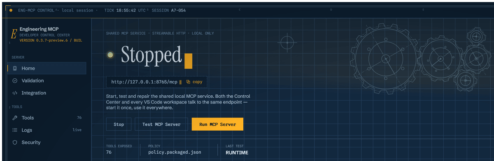

# WPF & .NET Engineering MCP Server

[](https://github.com/mangyan1/wpf-dotnet-engineering-mcp/actions/workflows/ci.yml)

Security-first local Model Context Protocol (MCP) server for authorized WPF UI automation, .NET diagnostics, ASP.NET observability, and VS Code engineering workflows on Windows. The current source publishes 76 structured tools for UI Automation, bounded in-process WPF diagnostics, .NET runtime observation, approved source analysis, ASP.NET observability, and evidence-based cross-layer diagnosis.

The server is not a general shell, unrestricted debugger, credential extractor, remote administration agent, or arbitrary process inspector.

**Current public preview:** [`v0.3.7-preview.6`](https://github.com/mangyan1/wpf-dotnet-engineering-mcp/releases/tag/v0.3.7-preview.6) · [Security policy](docs/SECURITY.md) · [Code-signing policy](docs/CODE-SIGNING-POLICY.md) · [Contributing](CONTRIBUTING.md)

## Control Center

[](https://github.com/mangyan1/wpf-dotnet-engineering-mcp/releases/tag/v0.3.7-preview.6)

The Windows Control Center keeps the shared local MCP runtime, validation, editor integration, tools, logs, and security controls in one place. This looping preview uses the packaged generic policy and contains no project or user data.

## Why this repository is verifiable

- Source, build scripts, release notes, dependency lock files, and security policies are public and versioned together.
- GitHub CI restores locked dependencies, builds on Windows with the pinned .NET SDK, runs all automated tests, and executes the static, product-neutrality, and sanitized secret gates.
- The MCP HTTP endpoint is loopback-only, authenticated, non-cacheable, and bounded. Network access from tools is denied unless an explicit policy authorizes it.
- The application contains no telemetry, analytics, crash reporting, or remote logging. It does not upload source, screenshots, diagnostics, or application data automatically.
- Release packages contain an SPDX SBOM, dependency inventory, SHA-256 manifest, security documentation, and code-signing disclosure.
- Preview binaries are Authenticode-signed and timestamped with a development certificate. This detects post-signing modification but is **not** a publicly trusted Windows publisher identity. Trusted SignPath signing remains pending approval.

Trust is based on inspectable controls and repeatable evidence, not the signature alone. Security-sensitive users should verify the checksum and build the matching public tag before authorizing an application.

## Requirements and bundled dependencies

| Use | Requirements |
| --- | --- |
| Installed MSI or portable ZIP | Windows x64. The application is self-contained and includes its .NET runtime; no separate .NET installation, Node.js, Python, WiX, or VS Code extension is required. VS Code is optional and needed only when using its MCP client. |
| Build and test from source | Windows x64, the .NET SDK selected by `global.json` (currently 10.0.400 with latest-patch roll-forward), PowerShell, Python 3 for the static gate, and Bash for the sanitized secret scan. Git for Windows supplies Bash on a typical Windows development machine. |
| Build a signed installer | The source-build requirements plus Windows SDK SignTool and an approved signing certificate. WiX is restored as a locked NuGet/MSBuild SDK dependency. |

NuGet versions are centralized in `Directory.Packages.props`, and every project has a committed lock file. Dependabot opens weekly update pull requests for NuGet, the optional VS Code extension manifest, and GitHub Actions. Minor and patch updates are grouped; major updates remain separate for deliberate review. Pull requests must pass locked restore, the NuGet advisory gate, dependency review, build, tests, static checks, and the sanitized secret scan before merge.

## What it provides

| Tool group | Count | Purpose |
| --- | ---: | --- |
| WPF automation | 18 | Attach to allowlisted WPF applications, inspect bounded UI state, interact semantically, and capture policy-gated redacted screenshots. |
| Advanced WPF metadata | 15 | Wait/assert operations, selector audits, inventories, and aggregate grid/tree/item/accessibility/window summaries. |
| Source analysis | 11 | Approved-root inventory/read operations, syntactic and semantic C# references, XAML analysis, and source correlation. |
| .NET diagnostics | 10 | Bounded runtime, counter, GC, thread, module, exception, trace, and privileged dump workflows. |
| WPF probe diagnostics | 6 | Binding, command, validation, DataContext type, and dispatcher metadata from an explicitly installed probe. |
| System and policy | 6 | Version, health, capability, permission, policy readiness, and exact per-tool authorization preflight. |
| UI analysis | 3 | Evidence-based accessibility and geometry audits plus explicitly heuristic UX observations. |
| ASP.NET observation | 3 | Sanitized health, request, and exception observations from an authenticated local adapter. |
| WPF/WPF-UI probe | 2 | Bounded probe operations and WPF-UI design-system evidence. |
| Cross-layer diagnosis | 2 | Correlate WPF, runtime, backend, and approved-source evidence without claiming causation. |
| **Total** | **76** | All published names use the portable `lowercase_with_underscores` MCP contract and structured output. |

## Privacy and safety boundary

- Process, source-root, operation, and capability allowlists enforce a least-privilege policy ceiling.
- The 21 advanced WPF and probe-diagnostic tools are metadata-only. They do not return UI text, cell or item values, raw AutomationIds, window titles, ViewModel values, validation messages, clipboard content, or raw screenshots.
- UI recording/replay and clipboard tools are deliberately absent.
- Screenshots are disabled unless policy explicitly permits them. The UIA redaction pipeline masks password, text-bearing, and policy-classified sensitive regions and fails closed when any visible sensitive region cannot be bounded. Custom-rendered or OCR-visible content remains a residual risk and should not be enabled against sensitive production screens.
- Probe operations never inject a probe, invoke commands, or read arbitrary object properties. The target application must explicitly install and authenticate the probe.
- Source output, exception observations, and other untrusted content are bounded and redacted before MCP output.
- Arbitrary shell commands, SQL, network targets, elevation, and unrestricted filesystem access are not exposed.
- Child processes receive a sanitized local-only `PATH`; relative and UNC/network tool paths are removed.
- `system_policy_diagnostics` explains broad policy readiness, while `system_tool_preflight` authoritatively checks one exact tool before an agent claims it is policy-disabled. Neither returns policy paths, process paths, source roots, tokens, or secrets.

See `docs/SECURITY.md` for the controlling security model and `docs/TOOL-CONTRACTS.md` for exact tool behavior.

## Quick start with the Control Center

Normal development uses one shared local MCP service:

1. Double-click `Start-ControlCenter.cmd` in the repository root.
2. Select or create the required least-privilege policy.
3. Choose **Run MCP Server**.
4. Choose **Connect to VS Code**.
5. Fully restart VS Code after the first connection so it inherits the per-user token.

The host listens only on `http://127.0.0.1:8765/mcp`. The Control Center creates `ENGINEERING_MCP_HTTP_TOKEN` in the current Windows user's environment without displaying it, and editor clients connect to the same authenticated process. The host also supports `--transport stdio` for compatible clients.

The Control Center owns the local service lifetime and stops it when the Control Center closes. Its sidebar always displays the running product version and short source-build revision, while the tooltip retains the full informational version for support checks. It provides fixed actions for builds, tests, MCP protocol checks, VS Code repair, WPF and ASP.NET fixture workflows, policy selection, and end-to-end validation; it does not expose an arbitrary command shell. `EngineeringMcp.Wpf.TestApp` is an automation fixture with intentional faults, not the management UI.

Source XAML tools accept either one approved `.xaml` file or an approved directory. ASP.NET applications can opt into the reusable adapter with `AddEngineeringMcpBackendDiagnostics` and `UseEngineeringMcpBackendDiagnostics`; the adapter records bounded request metadata plus redacted, truncated exception details and supports exact action markers for `diagnose_click`. The target must receive the same strong `ENGINEERING_MCP_BACKEND_TOKEN` as the MCP host, normally by being launched from the Control Center fixture workflow.

Optional: run `Install-ControlCenter-Shortcut.cmd` once to create a Desktop shortcut. See `docs/DEV-CONTROL-CENTER.md`.

## Download and verify a release

When a binary release is published, download the MSI or portable ZIP and `SHA256SUMS.txt` from the [GitHub Releases page](https://github.com/mangyan1/wpf-dotnet-engineering-mcp/releases). Keep release binaries out of the source tree.

Verify the MSI checksum in PowerShell and compare it with the matching line in `SHA256SUMS.txt`:

```powershell
Get-FileHash -Algorithm SHA256 .\EngineeringMcp-0.3.7-preview.6-win-x64-Setup.msi
```

Inspect its Authenticode signature and timestamp:

```powershell
Get-AuthenticodeSignature .\EngineeringMcp-0.3.7-preview.6-win-x64-Setup.msi |
    Select-Object Status, StatusMessage, SignerCertificate, TimeStamperCertificate
```

On machines that do not trust the included development certificate, Windows will not report a publicly trusted publisher even though the signature and timestamp are present. Do not bypass that distinction. See the [code-signing policy](docs/CODE-SIGNING-POLICY.md) for the current and planned trust models.

## VS Code

**Connect to VS Code** installs a user-profile HTTP MCP entry, making the service available across workspaces without opening this repository. `.vscode/mcp.json` is retained as a repository-local development example.

The development extension under `vscode-extension/` can register the same HTTP endpoint programmatically. VS Code must already have inherited `ENGINEERING_MCP_HTTP_TOKEN`. See `docs/VSCODE.md` for the connection and first-runtime test.

## Windows installer and portable package

Build the self-contained Windows package, portable ZIP, and per-user MSI with:

```powershell
powershell -ExecutionPolicy Bypass -File build/release-hardening.ps1
```

Version 0.3.7-preview.6 produces:

- `artifacts/release/EngineeringMcp-0.3.7-preview.6-win-x64.zip`
- `artifacts/release/EngineeringMcp-0.3.7-preview.6-win-x64-Setup.msi`

Preview labels remain in the portable ZIP/MSI filenames and application manifest. The MSI uses the numeric Windows Installer product version (`0.3.7`) because MSI product versions do not accept semantic-version suffixes; `app-manifest.json` identifies the `preview` channel, full `0.3.7-preview.6` version, and exact source commit.

The package contains the Control Center, private MCP host, locked-down default policy, documentation (including this README), SPDX 2.3 SBOM, dependency inventory, SHA-256 checksums, and the .NET runtime. The portable package runs without installing .NET or opening the source repository.

The MSI installs per-user under `%LOCALAPPDATA%\Programs\Engineering MCP` without elevation, adds Start Menu and Desktop shortcuts, and supports repair, upgrade, and uninstall. Application files and shortcuts are removed on uninstall. User-level MCP configuration, security tokens, selected policy, and environment selection are intentionally preserved so a reinstall does not break editor registration.

Standalone mode keeps server control, protocol testing, policy selection, and **Connect to VS Code**. Repository builds and fixtures remain available only from a source checkout. To authorize any WPF application, use **Authorize WPF workspace** and select the solution or repository root after building the application. Engineering MCP discovers built `UseWPF=true` executable projects, creates exact-path process rules, enables privacy-safe WPF/source diagnostics, and stores the validated policy outside the installation directory. Multiple workspaces receive distinct durable policies. The installer itself defaults to metadata-only access.

See [`docs/WPF-WORKSPACES.md`](docs/WPF-WORKSPACES.md) for safe centralized-property discovery, manual executable authorization, policy boundaries, classic WPF support, and the application-integration contract.

Automatic updating is inactive until a trusted release feed is configured.

### Signing

Official releases require a trusted code-signing certificate. Set `ENGINEERING_MCP_SIGNING_THUMBPRINT` and run the release command with `-RequireSigning`.

For internal development testing:

```powershell
powershell -ExecutionPolicy Bypass -File build/release-hardening.ps1 `
  -SelfSign `
  -RequireSigning `
  -RequireCleanSource `
  -ExpectedVersion 0.3.7-preview.6 `
  -SourceRevision (git rev-parse HEAD)
```

This creates or reuses a non-exportable `Engineering MCP Development` certificate in `Cert:\CurrentUser\My`, signs the Engineering MCP binaries with SHA-256 and an RFC 3161 timestamp, and includes the public `.cer` in the package documentation. It does not add the certificate to Trusted Root. Other machines must explicitly trust that certificate; a development signature does not establish public publisher identity or Microsoft Defender SmartScreen reputation.

Unsigned output must not be promoted as an official release.

See [`docs/CODE-SIGNING-POLICY.md`](docs/CODE-SIGNING-POLICY.md) for release provenance, approval roles, privacy commitments, and the planned SignPath Foundation trust path.

## Build and test

```powershell
dotnet build DotNetEngineeringMcp.sln --configuration Release --no-restore
dotnet test DotNetEngineeringMcp.sln --configuration Release --no-build
python scripts/self-test-static.py
```

Validate the installed MSI, VS Code registration, uninstall/reinstall persistence, and the installed 76-tool surface with:

```powershell
powershell -NoProfile -ExecutionPolicy Bypass -File scripts/test-installed-vscode.ps1 `
  -MsiPath artifacts/release/EngineeringMcp-0.3.7-preview.6-win-x64-Setup.msi `
  -ExerciseReinstall `
  -Configuration Release
```

Tests use synthetic fixtures. The automated suite exercises a real WPF process for masked PNG capture and authenticated probe restart, plus a live ASP.NET application for named-pipe action correlation. Full interactive WPF fixture coverage remains an operator-run Control Center gate.

## Project status

The projects target .NET 10 and pin the official `ModelContextProtocol` package to 2.2.0. The `0.3.7-preview.6` public pre-release carries bounded universal WPF workspace discovery and durable exact-path policy provisioning alongside real-process screenshot masking, restartable authenticated WPF probing, live ASP.NET action correlation, exact-file XAML auditing, provider-chrome selector classification, PII-redaction coverage, protected release governance, and the validated Microsoft.Build.Framework 17.14.28 dependency update. See `IMPLEMENTATION_STATUS.md` for exact completion state and `docs/ROADMAP.md` for phase gates.

## Source-of-truth order

1. `docs/SECURITY.md`
2. `docs/CHARTER.md`
3. `docs/TOOL-CONTRACTS.md`
4. `docs/CAPABILITIES.md`
5. Accepted ADRs in `docs/ADR/`
6. Implementation
7. Tests
8. README and examples

If implementation conflicts with security policy, the implementation is defective.

## License

Copyright 2026 mangyan1.

Engineering MCP is open-source software licensed under the [Apache License, Version 2.0](LICENSE). You may use, modify, and redistribute it, including commercially, subject to the license terms. Preserve the license and attribution notices when redistributing the software. Third-party components remain under their respective licenses.
